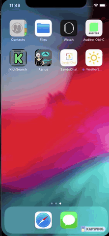

# Weather Sando iOS APP - Swift 4.2

Weather Sando is a simple iOS app for weather forecasting. 

- It shows the actual weather for your current location. In the forecast tab, show the forecast for the next 5 days at your current location. 

- This app support iOS 11.0+

## Weather Provider

[OpenWeatherMap](http://openweathermap.org/api) API used as weather provider.

- Today Weather endpoint: [view](http://api.openweathermap.org/data/2.5/weather?lat=41.0098876953125&lon=28.8713888390362&units=metric&APPID=67baa261ccbfd6c99703333a6dc8a562)

- Forecast Weather enpoint used: [view](http://api.openweathermap.org/data/2.5/forecast?lat=41.0098876953125&lon=28.8713888390362&units=metric&APPID=67baa261ccbfd6c99703333a6dc8a562)

- Parameters of API respond: [docs](https://openweathermap.org/api)

## Firebase Database

Use [Firebase Database](https://firebase.google.com/docs/database/ios/start) for simple storing of current location  and  temperature when this is available.

- Create A Project Database on Firebase

- Create A GoogleService-Info.plist on Firebase, and change it with same file on Xcode Project 

- Give read and write permission on Project Database in Firebase: [view](https://stackoverflow.com/a/43295908)

- Add FirebaseAppDelegateProxyEnabled type "Boolean" value "NO" in your Xcode Project info.plist

## How to build

1) Install pods

2) Open the workspace in Xcode

3) Sign up on [openweathermap.org/appid](http://openweathermap.org/appid) to get an appid

You should find `OpenWeatherMapClient.swift` file and put your appid in the line 15:

``fileprivate let apiKey = "YOUR_ID"``
 
4) Compile and run the app in your simulator

5) If you don't see any data, please check "Simulator" -> "Debug" -> "Location" to change the location.

# Requirements

* Xcode 10.1
* iOS 11+

